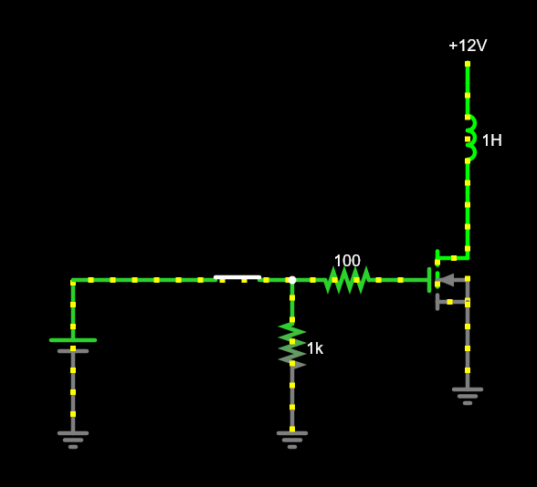

# ESP32 Mortar Controller

# Components
List of components
- 6V-24V Battery
- Buck Converter ~1A
- ESP32 
- Illuminated Button
- Limit switch
- 2 potentiometers
- Relay or MOSFET
- Lora module (optional)

## Buck converter
This is a DC-DC converter that will convert the 12V battery voltage to 5V for the microcontroller. 
Can get a simple buck converter from [Aliexpress](https://www.aliexpress.com/item/1005007331564532.html).

The input voltage should be 6V+ and the output voltage must be able to be set to 5V. There is a potentiometer on the board to set the voltage, rotate it counter clockwise to decrease the voltage. 

The voltage must be set before connecting it to the microcontroller.
## ESP32
Using the [DOIT ESP32 DEVKIT V1](https://www.circuitstate.com/pinouts/doit-esp32-devkit-v1-wifi-development-board-pinout-diagram-and-reference/). Any ESP32 will work as long as the required GPIO pins are available. 

  
DOIT ESP32 DEVKIT V1 Pinout

   

Some pins should be left floating during boot, this pins can be used but will only use them if nothing left.

Will use these pins.

 

Using the Arduino IDE 2, follow this [guide](https://randomnerdtutorials.com/installing-esp32-arduino-ide-2-0/) to setup the IDE for ESP32.

## Illiminated push button 
Have this button [Ring, 5V, Momentary, Blue](https://www.aliexpress.com/item/4000032282063.html) 
Pin functions are marked on switch.
Will use C (common) and NO (Normally open) for the switch.
Connect C to `GND` and NO to `ARM` pin.

Use + and - for LED, note there is already a resistor inside so no current limiting resistor is needed.
Current is around 2mA so can be driven from GPIO pin.
Connect - to `GND` and + to `STATUS_LED`

The button does not need to be illuminated, the LED can be separate or not used at all. The button should be momentary and not latching.

## Limit switch 
Any limit switch will work, something like [this](https://www.aliexpress.com/item/1005006085607858.html), if there are 3 pins then only use the common and the normally open pins. Connect common to `GND` and NO to `LIMIT_SWITCH`.
## Potentiometers
The only requirements for the potentiometers is they should be linear and between 1K-10K. Something like [this](https://www.aliexpress.com/item/1005006659172507.html).

Connect pin 1 to `GND`, pin 3 to `3V3`. For the initial delay pot, connect pin 2 to `DELAY_POT` and for the pot that controls the fire power connect pin 2 to `POWER_POT`

## Relay or MOSFET
Can use a relay like [this](https://www.aliexpress.com/item/10000000669335.html). However looking at the [datasheet](https://www.datasheetcafe.com/wp-content/uploads/2015/10/SRD-05VDC-SL-C-Datasheet.pdf) the `Operation Time` can be 10ms. This may be to slow for out operation.

Will probably want a MOSFET for the faster switching speed. A 100Ω gate resistor and a 1kΩ pull down resistor will be needed. 

 

There can be an issue with driving the gate with only 3.3V, however the current required to turn on the solenoid should not be very large and it will only be in for a short amount of time.
A MOSFET like [this](https://www.aliexpress.com/item/1005006080182930.html) will work, the main thing is the MOSFET must be N-Channel and have a voltage rating greater then 12V. 

---

# Software

  Use board type `DOIT ESP32 DEVKIT V1`

  Use [external interrupts](https://microcontrollerslab.com/esp32-external-interrupts-tutorial-arduino-ide/) for limit switch and ARM.  
  ARM will toggle the state so will need to account for switch bouncing, a simple delay could work.