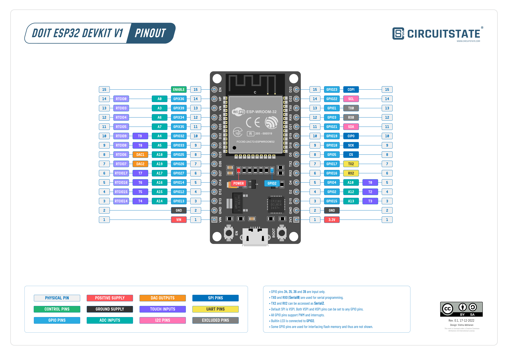
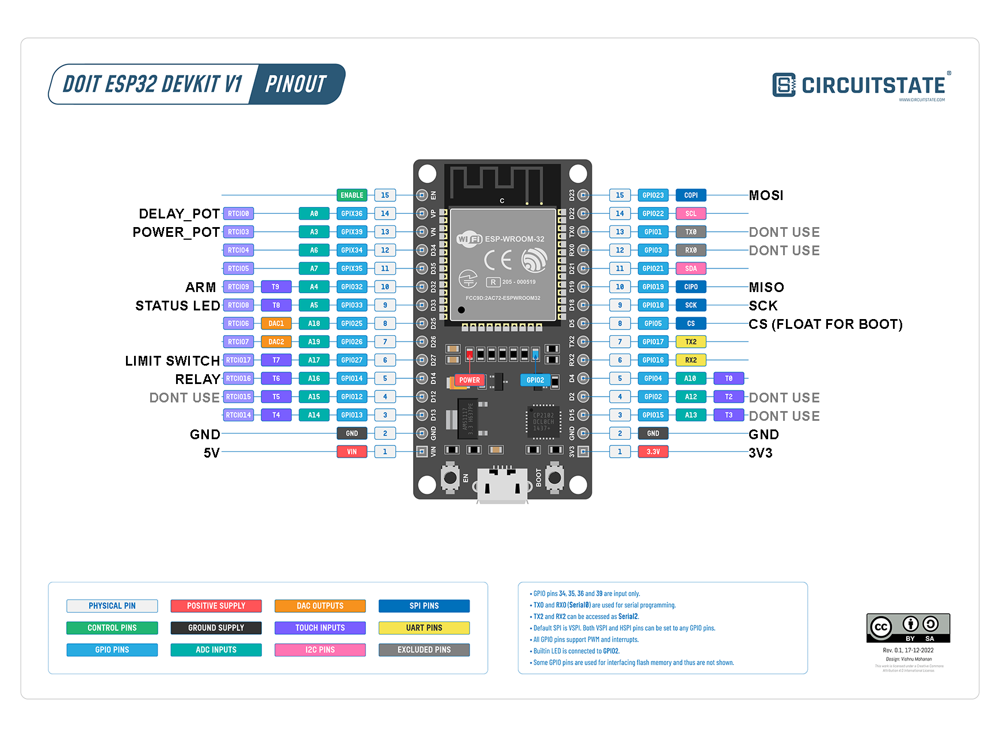

# ESP32 Mortar Controller

## Components
- 6V-24V Battery
- Buck Converter ~1A
- ESP32 (DEVKITV1)
- Illuminated Button
- 2 potentiometers
- Relay or MOSFET
- Lora module (optional)

### ESP32

Have [this ESP32](https://www.circuitstate.com/pinouts/doit-esp32-devkit-v1-wifi-development-board-pinout-diagram-and-reference/)

 

Some pins should be left floating during boot, this pins can be used but will only use them if nothing left.

## Plan

## Pinout
 

## Software

  Use board type `DOIT ESP32 DEVKIT V1`

  Use [external interrupts](https://microcontrollerslab.com/esp32-external-interrupts-tutorial-arduino-ide/) for limit switch and ARM.  
  ARM will toggle the state so will need to account for switch bouncing, a simple delay could work.